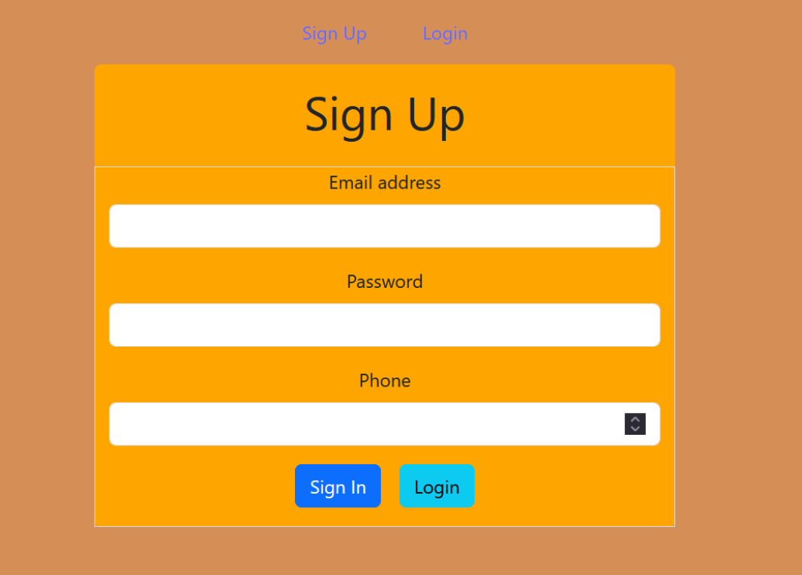
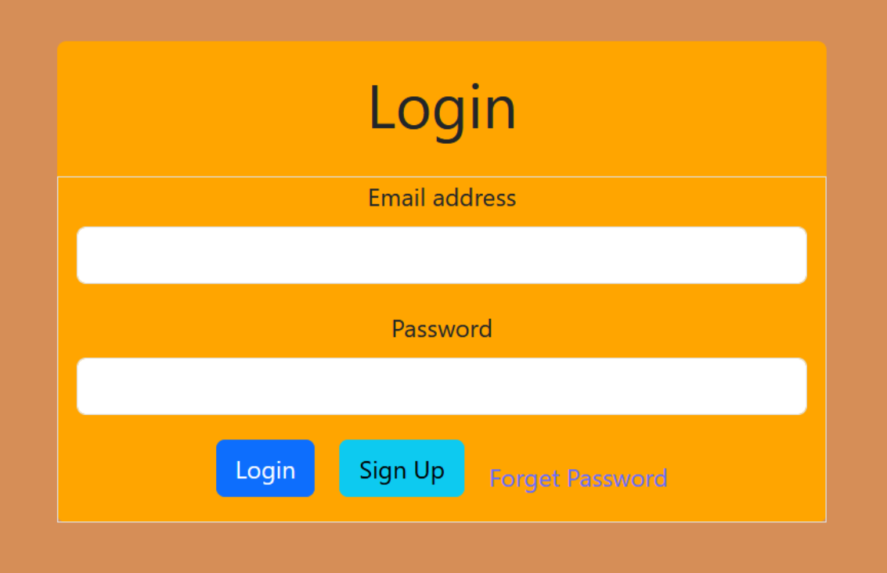
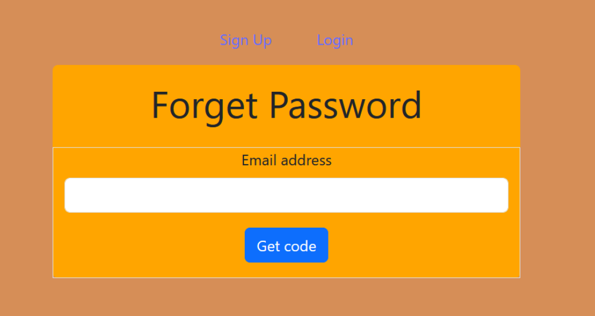
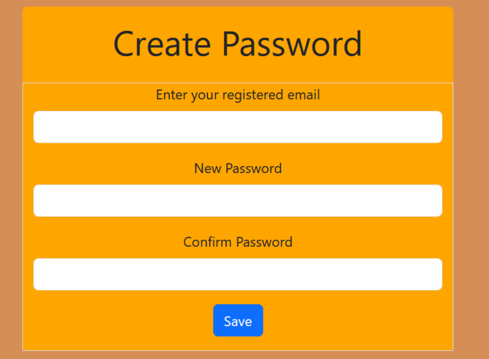

## This repo is to perform forget password with backend communication!!

**Outputs**
## Sign Up page

## Login Page

## Forget password Page

## confirm password page

## User Authentication

    Signup: Users can register for an account by providing necessary details like username, email, password, mobile number
    Login: Registered users can sign in using their email and password.
    Forgot Password: Users can request a password reset by providing their email.
    Reset Password: Passwords can be reset using a token sent to the user's email.

## Frontend

    React
    React Router
    Bootstrap

## Backend
 
  Node.js
  Express.js
  MongoDB
  Bcrypt
  Nodemailer

  ## Deployment
  **Frontend**
  **Backend**

  ## Installation and Setup

    
    Clone the repository
    Install dependencies using npm install
    Start the frontend and backend servers
    Open the application in your browser

